#  Reminder Me - SwiftUI Task & Reminder App


A simple  Reminder & To-Do List application built entirely with modern Apple technologies

## ✨ Features

- **To-Do List:** Easily add, view, and manage your tasks.
- **Powerful Reminders:** Set times for your tasks.
- **Local Notifications:** Receive alerts for your upcoming tasks right on your device, even when offline.
- **Persistent Storage:** Your data is securely saved on your device using **SwiftData**, ensuring your tasks are always there when you need them.
- **Clean UI:** A beautiful and user-friendly interface built with **SwiftUI**.
- **Mark as Completed:** Keep track of your progress by marking tasks as complete.

## 📸 Screenshots

| | | |
| :---: | :---: | :---: |
| 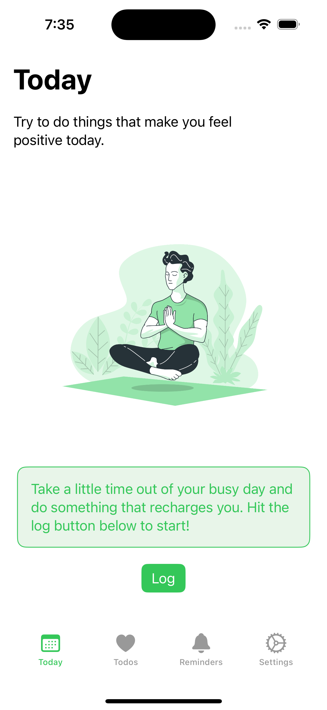 | 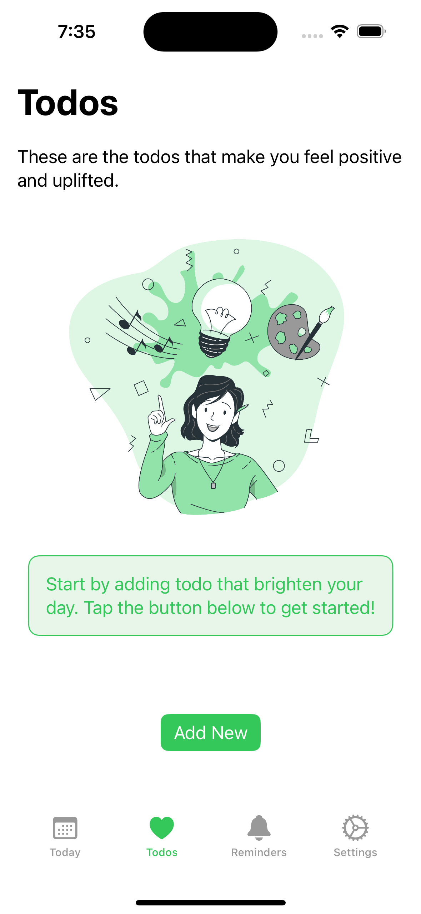 | 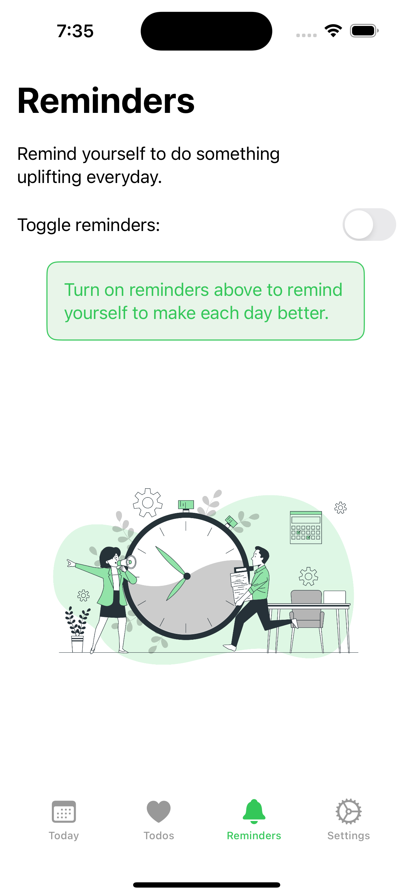 |
| 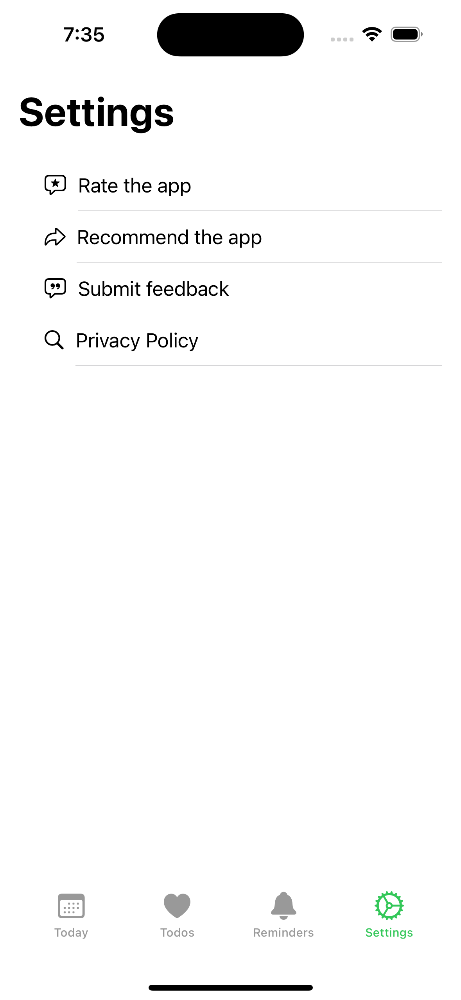 | 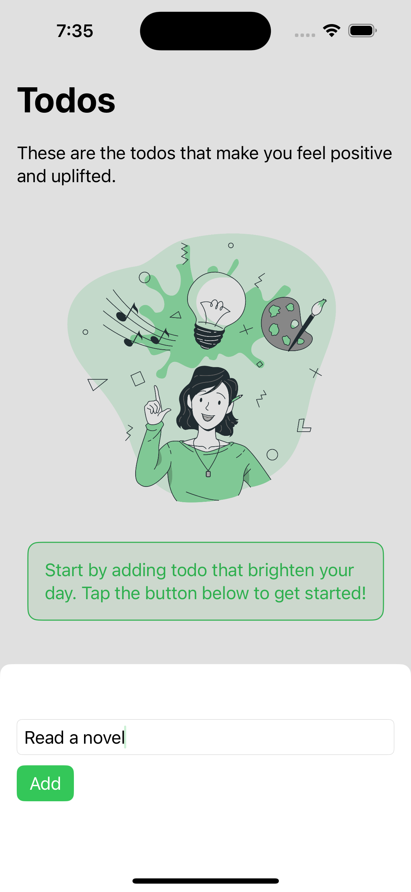 | 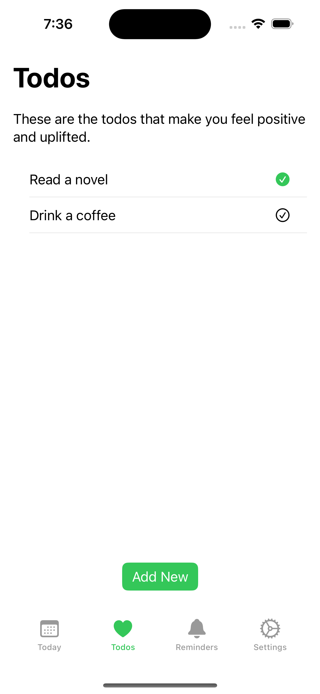 |
| 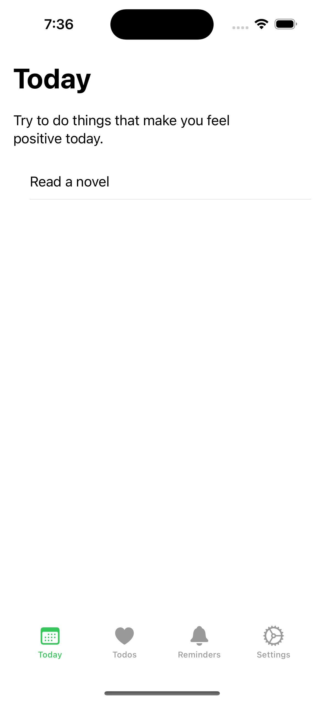 | 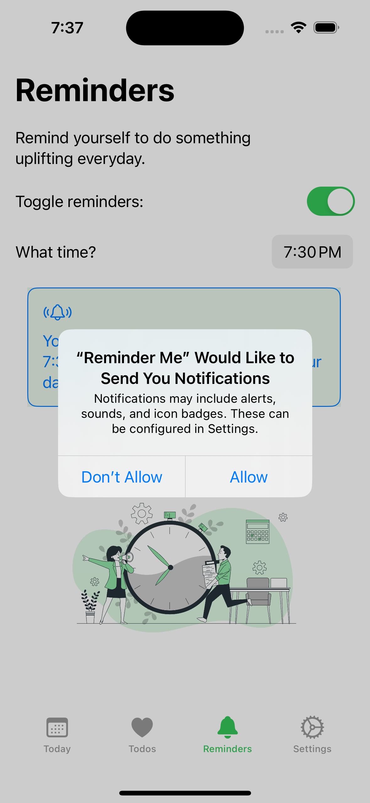 | 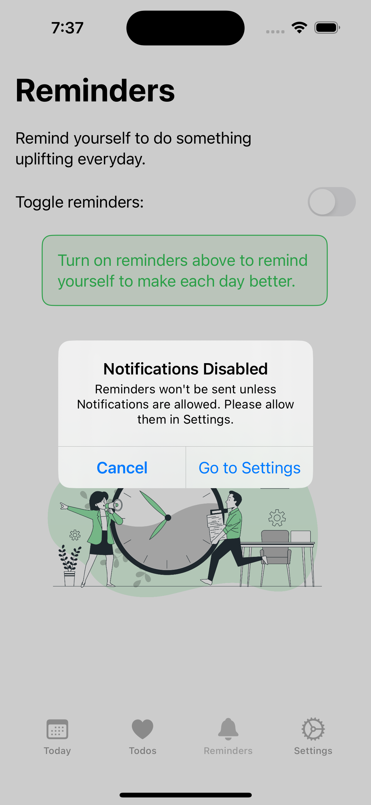 |
| 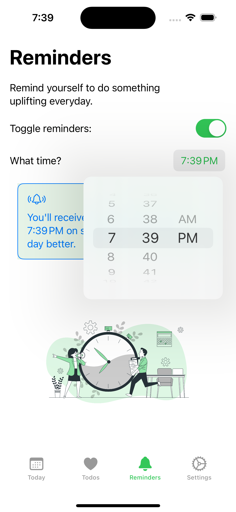 | 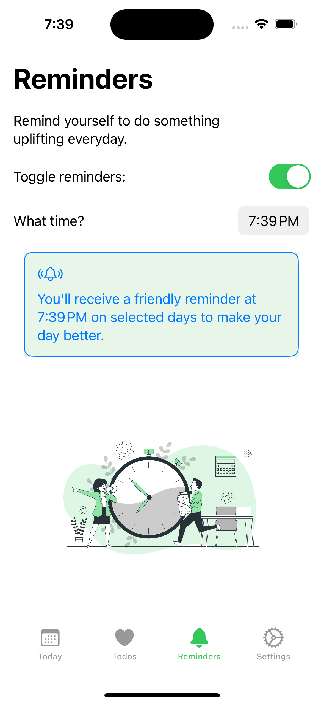 | 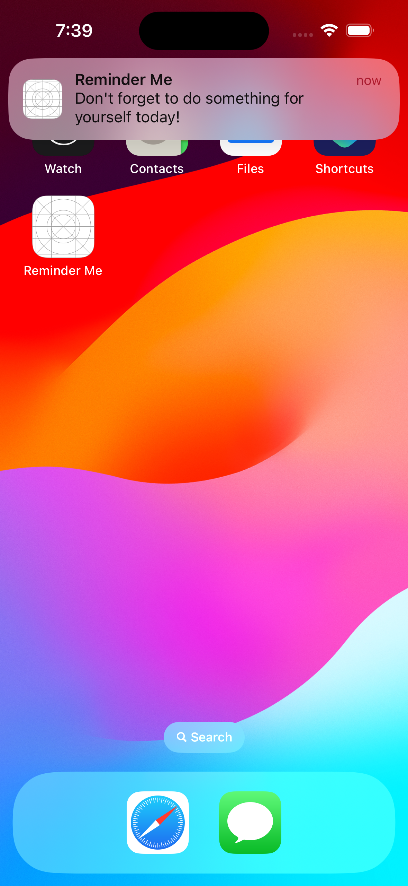 |


## 🛠️ Technologies Used

This project is built using the latest Apple technologies for iOS development:

- **SwiftUI:** For building the entire user interface declaratively.
- **SwiftData:** For robust and simple local data persistence.
- **UserNotifications Framework:** For scheduling and delivering local notifications.
- **Xcode:** The project is developed and managed using Xcode 15.

## 📋 Requirements

- iOS 17.0+
- Xcode 15.0+

## 🚀 How To Get Started

To run this project on your local machine:

1.  **Clone the repository:**
    ```bash
    git clone https://github.com/whisnuys/reminder-me-app-swift.git
    ```

2.  **Open the project in Xcode:**
    ```bash
    cd reminder-me-app-swift
    open "Reminder Me.xcodeproj"
    ```

3.  **Run the app:**
    Select your target device (or a simulator) and press `Cmd+R` to build and run the application. The app will ask for permission to send notifications—make sure to accept to test the reminder functionality!

## 📄 License

This project is licensed under the MIT License - see the [LICENSE.md](LICENSE.md) file for details.
